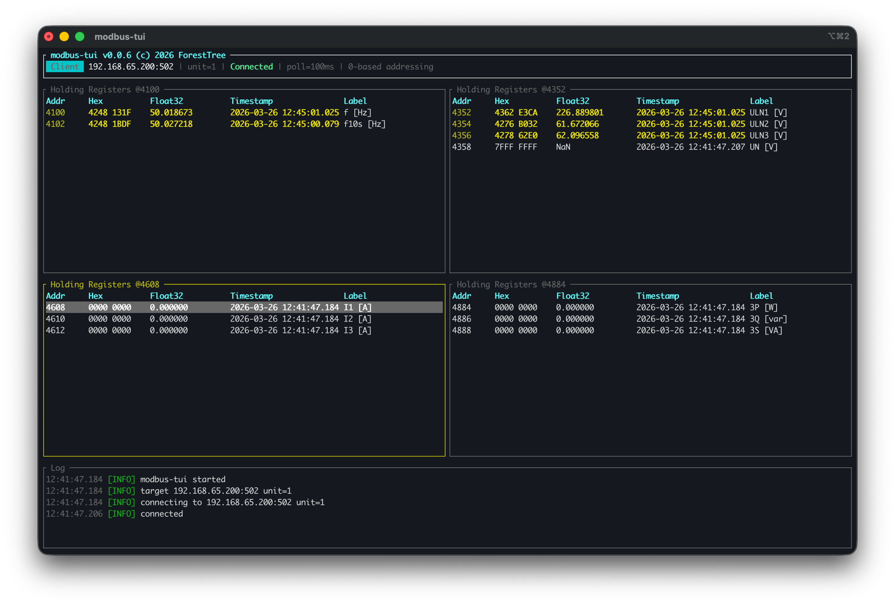

# modbus-tui

A terminal-based Modbus TCP client and server for inspecting, monitoring, and testing Modbus devices.



## Features

- **Client mode** — connect to a Modbus TCP device and poll registers in real time
- **Server mode** — run a Modbus TCP server with configurable registers for testing
- **Multiple register types** — Coils, Discrete Inputs, Holding Registers, Input Registers
- **Numeric formats** — view registers as i16, u16, i32, u32, i64, u64, f16, f32, f64, binary, or ASCII
- **Multi-pane layout** — display multiple register ranges side by side
- **Write support** — modify holding registers and coils in client mode; all types in server mode
- **Change highlighting** — actively changing values stay highlighted; fades out after value stabilizes
- **Register labels** — assign custom labels to individual registers
- **Byte/word-swap** — configurable byte and word order for all register types
- **JSON config** — load and save full configuration including formats and labels
- **Raw packet logging** — optional hex dump of Modbus TCP frames in the log window
- **Export** — export current register values to JSON
- **Cross-platform** — runs on Linux, macOS, and Windows

## Platform Support

modbus-tui runs natively on all major platforms:

| Platform | Architecture |
|----------|-------------|
| Linux | x86_64 (musl) |
| macOS | x86_64, ARM (Apple Silicon) |
| Windows | x86_64 |

Pre-built binaries for all platforms are available on the [Releases](https://github.com/ForestTree/modbus-tui/releases) page.

## Installation

```sh
cargo install --path .
```

Or build from source:

```sh
cargo build --release
```

## Usage

### Client mode

Connect to a Modbus TCP device and monitor registers:

```sh
# Read 10 holding registers starting at address 0
modbus-tui --hr 0:10

# Multiple register ranges with custom format
modbus-tui -H 192.168.1.100 -P 502 --hr 0:10:f32 --hr 100:20 --ir 0:8 --co 0:16

# One-based addressing, decimal display
modbus-tui -r 1 -D --hr 1:10

# Custom poll interval (500ms), hide hex column
modbus-tui -p 500 -n --hr 0:10

# Word-swap floats and integers separately
modbus-tui -i -f --hr 0:10:f32

# Word-swap all multi-register types (shortcut for -i -f)
modbus-tui -w --hr 0:10:f32

# Byte-swap all registers (reverse bytes within each u16)
modbus-tui -b --hr 0:10

# Combine byte-swap with word-swap
modbus-tui -b -w --hr 0:10:f32

# Enable raw packet logging (hex dump of Modbus TCP frames)
modbus-tui -R --hr 0:10
```

### Server mode

Run a Modbus TCP server for testing:

```sh
# Server with holding registers and coils
modbus-tui -m server --hr 0:10 --co 0:16

# Server on a custom port with all register types
modbus-tui -m server -P 5020 --hr 0:20 --ir 0:10 --co 0:8 --di 0:8
```

### JSON configuration

```sh
# Load configuration from file
modbus-tui -c config.json

# Override host and port from config via CLI
modbus-tui -c config.json -H 10.0.0.1 -P 1502
```

Only `ranges` is required in the config file — all other fields have defaults and can be overridden with CLI arguments.

Example `config.json`:

```json
{
  "mode": "client",
  "host": "192.168.1.100",
  "port": 502,
  "unit": 1,
  "poll_interval_ms": 200,
  "start_reference": 0,
  "swap_ints": false,
  "swap_floats": false,
  "swap_words": false,
  "swap_bytes": false,
  "hide_hex": false,
  "decimal_addresses": false,
  "raw_packets": false,
  "ranges": [
    {
      "reg_type": "holdingregisters",
      "start": 0,
      "count": 10,
      "initial_format": "Float32",
      "labels": { "0": "Temperature", "2": "Pressure" }
    },
    { "reg_type": "inputregisters", "start": 0, "count": 8 },
    { "reg_type": "coils", "start": 0, "count": 16 }
  ],
  "initial_values": {
    "hr:0": 1234,
    "co:0": 1
  }
}
```

Config fields and defaults:

| Field | Default | Description |
|-------|---------|-------------|
| `mode` | `"client"` | `"client"` or `"server"` |
| `host` | `"127.0.0.1"` | Target host or IP address |
| `port` | `502` | TCP port |
| `unit` | `1` | Modbus unit ID (0–247) |
| `poll_interval_ms` | `100` | Poll interval in milliseconds (10–60000) |
| `start_reference` | `0` | `0` = zero-based, `1` = one-based addressing |
| `swap_ints` | `false` | Word-swap 32/64-bit integers |
| `swap_floats` | `false` | Word-swap 32/64-bit floats |
| `swap_words` | `false` | Word-swap all multi-register types (equivalent to `swap_ints` + `swap_floats`) |
| `swap_bytes` | `false` | Byte-swap all registers (reverse bytes within each u16) |
| `hide_hex` | `false` | Hide raw hex column |
| `decimal_addresses` | `false` | Show addresses in decimal |
| `raw_packets` | `false` | Log raw Modbus TCP packets (hex dump) in the log window |
| `ranges` | `[]` | Register ranges to poll/display |
| `initial_values` | `{}` | Server mode: initial values (`"hr:0": 1234`, `"co:0": 1`) |

Range object fields:

| Field | Required | Description |
|-------|----------|-------------|
| `reg_type` | yes | `"holdingregisters"`, `"inputregisters"`, `"coils"`, or `"discreteinputs"` |
| `start` | yes | Start address (protocol, 0-based) |
| `count` | yes | Number of registers |
| `initial_format` | no | Numeric format: `"Int16"`, `"Uint16"`, `"Int32"`, `"Uint32"`, `"Int64"`, `"Uint64"`, `"Float16"`, `"Float32"`, `"Float64"`, `"Bin16"`, `"Ascii"` |
| `labels` | no | Map of protocol address to label string |

## CLI arguments

### Connection

| Flag | Long | Default | Description |
|------|------|---------|-------------|
| `-m` | `--mode` | `client` | Run as `client` or `server` |
| `-H` | `--host` | `127.0.0.1` | Target host or IP address |
| `-P` | `--port` | `502` | TCP port |
| `-u` | `--unit` | `1` | Modbus unit ID (0–247) |

### Register ranges (repeatable)

| Flag | Long / Alias | Format | Description |
|------|--------------|--------|-------------|
| | `--holding-registers` / `--hr` | `START:COUNT[:FMT]` | Holding register range with optional format |
| | `--input-registers` / `--ir` | `START:COUNT[:FMT]` | Input register range with optional format |
| | `--coils` / `--co` | `START:COUNT` | Coil range |
| | `--discrete-inputs` / `--di` | `START:COUNT` | Discrete input range |

Format codes (`FMT`): `u16`, `i16`, `u32`, `i32`, `u64`, `i64`, `f32`, `f64`, `b16`, `ascii`

### Display options

| Flag | Long | Description |
|------|------|-------------|
| `-r` | `--start-reference` | Address reference: `0` = zero-based, `1` = one-based (default: `0`) |
| `-D` | `--decimal-addresses` | Show addresses in decimal instead of hex |
| `-n` | `--no-hex` | Hide raw hex column |
| `-R` | `--raw-packets` | Log raw Modbus TCP packets (hex dump) in the log window |

### Byte/word-swap

| Flag | Long | Description |
|------|------|-------------|
| `-b` | `--swap-bytes` | Byte-swap all registers (reverse bytes within each u16: `0xABCD` → `0xCDAB`) |
| `-i` | `--swap-ints` | Word-swap 32/64-bit integers (reverse register order) |
| `-f` | `--swap-floats` | Word-swap 32/64-bit floats (reverse register order) |
| `-w` | `--swap-words` | Word-swap all multi-register types (equivalent to `-i` + `-f`) |

### Other

| Flag | Long | Default | Description |
|------|------|---------|-------------|
| `-p` | `--poll-interval` | `100` | Poll interval in ms (10–60000) |
| `-c` | `--config` | | Path to JSON config file |

When `-c` is used, CLI arguments (`-H`, `-P`, `-u`, `-m`, `-p`) override values from the config file.

## Addressing: zero-based vs one-based

The Modbus protocol uses **zero-based** addresses internally — the first holding register is address 0 on the wire. However, many device manuals and SCADA tools use **one-based** numbering (the first holding register is labeled 1, or 40001 in the traditional 5-digit convention).

The `-r` / `--start-reference` flag controls how modbus-tui maps between user-facing addresses and protocol addresses:

| `-r` value | User-facing address | Protocol address (on the wire) | Convention |
|------------|--------------------|---------------------------------|------------|
| `0` (default) | 0 | 0 | Zero-based — addresses match the protocol directly |
| `1` | 1 | 0 | One-based — displayed addresses are offset by 1 from protocol addresses |

### How it works

- **Display**: the address shown in the UI = protocol address + `start_reference`
- **CLI input**: the START value you provide on the command line is a **user-facing** address, automatically converted to a protocol address by subtracting `start_reference`
- **Protocol**: the actual Modbus request always uses the zero-based protocol address

### Examples

```sh
# Zero-based (default): request protocol address 0, display as 0x0000
modbus-tui --hr 0:10

# One-based: START=1 maps to protocol address 0, displayed as 1 (or 0x0001)
modbus-tui -r 1 --hr 1:10

# One-based with decimal display
modbus-tui -r 1 -D --hr 1:10
```

Both commands above poll the same registers on the wire (protocol addresses 0–9). The difference is only in what the user sees and types.

### Practical guidance

- Use `-r 0` (or omit the flag) when the device documentation uses zero-based addresses
- Use `-r 1` when the documentation uses one-based addresses (e.g. "register 1" means protocol address 0), so that what you see in modbus-tui matches the datasheet
- In JSON config, set `"start_reference": 1` for the same effect — note that `start` values in the `ranges` array are always **protocol addresses** (zero-based)

## Swap options explained

All swaps are applied **before** value interpretation (read) and in reverse order **after** value parsing (write). The Hex column reflects the same swapped state as the converted value.

### Endianness and Modbus

The Modbus specification defines **big-endian** (most-significant byte first) byte order within each 16-bit register. For example, the value `0x0102` is transmitted as byte `0x01` followed by `0x02`. This is the default assumption in modbus-tui — with no swap flags, bytes within each register are interpreted in big-endian order and multi-register values are assembled high-word-first.

However, many real-world devices deviate from this convention:

| Deviation | Swap flag | Resulting byte order |
|---|---|---|
| Little-endian **bytes** within registers | `-b` | Swaps to big-endian so values are interpreted correctly |
| Little-endian **word order** for integers | `-i` | Reverses register order for multi-register integer types |
| Little-endian **word order** for floats | `-f` | Reverses register order for multi-register float types |
| Little-endian **word order** for all types | `-w` | Reverses register order for all multi-register types (`-i` + `-f`) |

A fully big-endian device (per the Modbus spec) needs no flags. A fully little-endian device — little-endian bytes *and* little-endian word order — needs `-b -w`.

### Processing order (read/display)

```
Raw registers from device → Step 1: byte-swap (-b) → Step 2: word-swap (-i/-f/-w) → Step 3: interpret value
```

### `-b` / `--swap-bytes`

Reverses the two bytes **within each u16 register**. Applies to **all** format types.

```
Register:  0xABCD
After -b:  0xCDAB
```

**Use case**: Devices that store data in little-endian byte order within registers.

### `-i` / `--swap-ints`

Reverses **register order** for multi-register **integer** types only.
Affects: Int32, Uint32, Int64, Uint64. No effect on floats or single-register types.

```
Uint32:  [0x0001, 0x0002]  → 0x00010002 = 65538
After:   [0x0002, 0x0001]  → 0x00020001 = 131073

Uint64:  [A, B, C, D]
After:   [C, D, A, B]  (swap 32-bit halves)
```

**Use case**: Devices that store multi-word integers in low-word-first order.

### `-f` / `--swap-floats`

Reverses **register order** for multi-register **float** types only.
Affects: Float32, Float64. No effect on integers or single-register types.

```
Float32:  [0x3F80, 0x0000]  → 0x3F800000 → 1.0
After:    [0x0000, 0x3F80]  → 0x00003F80 → 2.278e-41
```

**Use case**: Devices that swap word order for floats independently of integers.

### `-w` / `--swap-words`

Reverses **register order** for **all** multi-register types. Equivalent to `-i` + `-f` combined. No effect on single-register types (Uint16, Int16, Float16, Bin16, Ascii).

```
Uint32:   [0x0001, 0x0002]  → reversed → [0x0002, 0x0001]  → 131073
Float32:  [0x3F80, 0x0000]  → reversed → [0x0000, 0x3F80]  → 2.278e-41
Uint64:   [A, B, C, D]      → swap 32-bit halves → [C, D, A, B]

Uint16:   0x0102  → unchanged (258)
Ascii:    0x4869  → unchanged ("Hi")
```

**Use case**: One flag when the device stores all multi-register values in reversed word order.

### Combining flags

`-b` runs first (byte-swap within each register), then word-swap reverses register order.

| Flags | Uint16 `0x0102` | Uint32 `[0x1234, 0x5678]` | Float32 `[0x3F80, 0x0000]` |
|---|---|---|---|
| none | 258 | `[0x1234, 0x5678]` = 305419896 | `[0x3F80, 0x0000]` = 1.0 |
| `-b` | 513 (`0x0201`) | `[0x3412, 0x7856]` = 873625686 | `[0x803F, 0x0000]` = -5.786e-39 |
| `-i` | 258 (no effect) | `[0x5678, 0x1234]` = 1450709556 | `[0x3F80, 0x0000]` = 1.0 (no effect) |
| `-f` | 258 (no effect) | `[0x1234, 0x5678]` = 305419896 (no effect) | `[0x0000, 0x3F80]` = 2.278e-41 |
| `-w` | 258 (no effect) | `[0x5678, 0x1234]` = 1450709556 | `[0x0000, 0x3F80]` = 2.278e-41 |
| `-b -w` | 513 (`0x0201`) | `[0x7856, 0x3412]` = 2018967570 | `[0x0000, 0x803F]` = 4.601e-41 |
| `-b -i -f` | 513 (`0x0201`) | `[0x7856, 0x3412]` = 2018967570 | `[0x0000, 0x803F]` = 4.601e-41 |

`-w` is a convenience shortcut -- `-b -w` is equivalent to `-b -i -f`.

## Keyboard shortcuts

| Key | Action |
|-----|--------|
| `q` / `Esc` | Quit |
| `Ctrl+C` | Quit |
| `Tab` / `Shift+Tab` | Switch between register panes |
| `F2` | Toggle focus between registers and log |
| `j` / `k` / `Up` / `Down` | Navigate rows |
| `PageUp` / `PageDown` | Scroll by 20 rows |
| `Home` / `End` | Jump to first / last row |
| `w` | Write value to selected register |
| `f` | Choose numeric format for active pane |
| `l` | Edit label for selected register |
| `d` | Switch to decimal addresses (active pane) |
| `D` | Switch to decimal addresses (all panes) |
| `h` | Switch to hex addresses (active pane) |
| `H` | Switch to hex addresses (all panes) |
| `:` | Open command bar |
| `F1` | Help |

### Commands

| Command | Description |
|---------|-------------|
| `:poll <ms>` | Change poll interval (10–60000 ms) |
| `:export [path]` | Export registers to JSON (default: `registers.json`) |
| `:save [path]` | Save current config for `-c` option (default: `config.json`) |

## License

Apache License 2.0 — see [LICENSE](LICENSE) for details.
